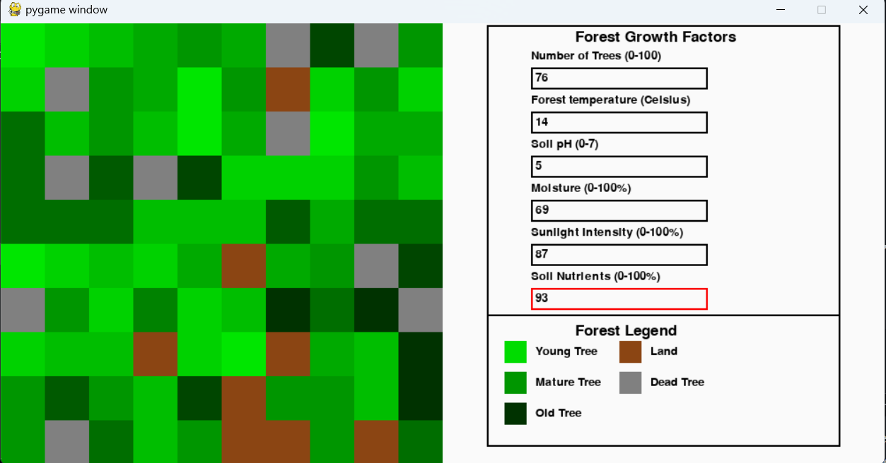
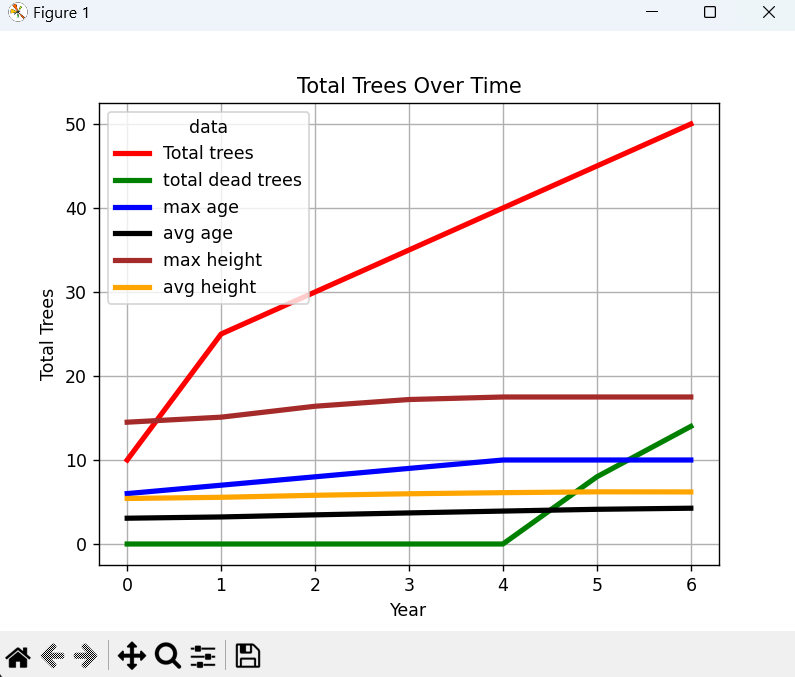
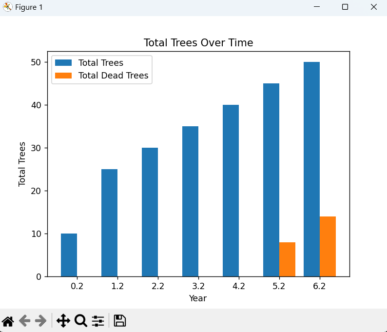

# Forest Ecosystem Simulation

A Python-based forest ecosystem simulation that models tree growth, aging, and competition for sunlight exposure. The simulation incorporates environmental factors such as temperature, pH, and water availability, adding complexity to ecosystem interactions.

## Features:
- **Realistic Ecosystem Interactions**: Simulates tree growth, competition, and regeneration based on environmental factors.
- **Diverse Tree Species**: Includes multiple species with unique growth rates, maximum ages, and environmental preferences.
- **Tree Death and Regeneration**: Neighboring trees grow after others reach their maximum age or die due to unfavorable conditions.
- **Real-Time Data Visualization**: Utilizes Matplotlib to visualize tree growth trends and environmental effects through bar and line graphs.
- **2D Grid-Based Simulation**: Built with Pygame, visually showcasing tree interactions, species diversity, and growth dynamics.

